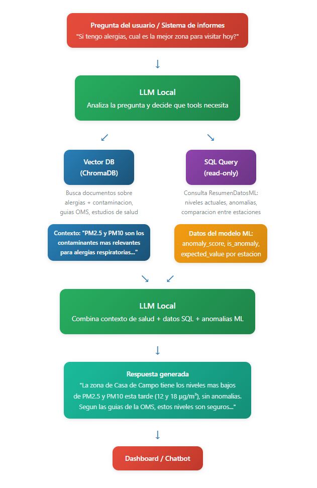

# TFM – Sistema Inteligente de Monitorización de Calidad del Aire (Madrid)

Este proyecto desarrolla un sistema basado en Machine Learning para analizar datos de calidad del aire en Madrid, detectar anomalías automáticamente y proporcionar información accesible mediante informes y un asistente conversacional.

---

## Descripción

La ciudad de Madrid dispone de una red de estaciones que miden la calidad del aire de forma continua. Sin embargo, estos datos suelen consumirse en bruto (CSV), lo que dificulta:

- Detectar fallos en sensores
- Interpretar tendencias
- Conocer el estado del aire en tiempo real

Este proyecto propone una solución integral con dos componentes principales:

### Parte 1 — Detección de anomalías
Modelos de ML aprenden el comportamiento normal de cada estación y contaminante para detectar:

- Fallos de sensores (datos congelados, incoherentes, etc.)
- Valores anómalos respecto al patrón histórico
- Episodios ambientales inusuales

### Parte 2 — Informes y asistente conversacional
- Generación automática de informes diarios
- Chatbot (ej. WhatsApp) para consultas en lenguaje natural:
  - “¿Dónde está el aire más limpio hoy?”
  - “¿Es normal este nivel de ozono en febrero?”

---

## Arquitectura del sistema

El sistema está diseñado en capas desacopladas:

---

## Datos

### Fuentes utilizadas

- Datos históricos de calidad del aire (Madrid)
- Datos en tiempo real (actualización cada ~20 minutos)
- Información de estaciones de control

### Estructura de los datos

Cada registro contiene:

- Estación
- Magnitud (NO2, O3, PM10, etc.)
- Fecha
- Valores horarios (H01–H24)
- Indicadores de validez (V01–V24)

---

## Modelado de anomalías

Se plantean dos tipos de anomalías:

### 1. Anomalías operativas (sensor)
- valores constantes prolongados
- datos faltantes
- incoherencias bruscas

### 2. Anomalías ambientales
- niveles inusuales respecto al histórico
- desviaciones respecto al comportamiento esperado

### Enfoques utilizados

Por definir

---

## Modelo de datos

### Tablas principales

#### CalidadAireHoras
Datos crudos normalizados (formato largo)

| Campo          | Tipo        | Descripción                                      |
|----------------|------------|--------------------------------------------------|
| PROVINCIA      | INTEGER    | Código de provincia                              |
| MUNICIPIO      | INTEGER    | Código de municipio                              |
| ESTACION       | INTEGER    | Identificador de estación                        |
| MAGNITUD       | INTEGER    | Código del contaminante                          |
| PUNTO_MUESTREO | STRING     | Identificador completo del punto de medición     |
| ANO            | INTEGER    | Año                                              |
| MES            | INTEGER    | Mes                                              |
| DIA            | INTEGER    | Día                                              |
| HORA           | INTEGER    | Hora de la medición (1–24)                       |
| VALOR          | FLOAT      | Valor medido del contaminante                    |
| VALIDACION     | STRING     | Indicador de validez (V = válido, N = no válido) |
| FECHA          | TIMESTAMP  | Fecha completa de la medición                    |

Por definir las demás, depende de la estructura de la BBDD

---

## Chatbot y LLM

El sistema integra un modelo de lenguaje para consultas en lenguaje natural:

### Funcionalidades

- consultas SQL sobre datos estructurados
- recuperación de contexto (normativa, salud)
- respuestas explicativas

### Ejemplos

- “¿Qué estación tuvo peor calidad del aire ayer?”
- “¿Es habitual este nivel de NO2 en invierno?”

### Enfoque

- herramientas controladas (no SQL libre)
- separación entre:
  - datos estructurados (SQL)
  - conocimiento contextual (RAG)

---

## Tecnologías

- Python
- Pandas / NumPy
- Scikit-learn
- (Opcional) TensorFlow / PyTorch
- SQL (SQLite / PostgreSQL / DuckDB)
- FastAPI (API backend)
- LLM (local o cloud)
- WhatsApp API (interfaz usuario)

---

## Pipeline del sistema

1. Ingesta de datos (históricos + tiempo real)
2. Limpieza y validación
3. Transformación a formato largo
4. Almacenamiento en base de datos
5. Ejecución de modelos de anomalía
6. Generación de scores
7. Agregación diaria
8. Generación de informes
9. Consulta vía chatbot